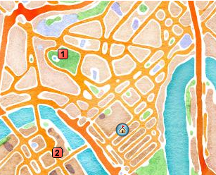

# POIMap
Create a leaflet map with Points of Interest


## Usage

```toml
title = "Brisbane"
here = [-27.470454, 153.0260231]

[[pois]]
label = "Roma Street Parkland"
coords = [-27.462172, 153.018771]

[[pois]]
label = "Cultural Centre"
coords = [-27.472863, 153.018066]
```

